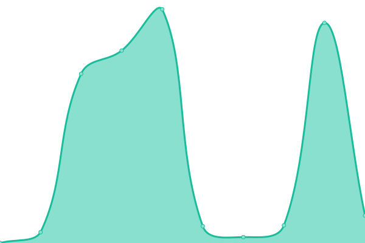

# [📈 Live Status](https://exhive.github.io/status): <!--live status--> **🟧 Partial outage**

This repository contains the open-source uptime monitor and status page for [exhive](https://www.exhive.ai/), powered by [Upptime](https://github.com/upptime/upptime).

[**Visit our status website →**](https://exhive.github.io/status)

<!--start: status pages-->
<!-- This summary is generated by Upptime (https://github.com/upptime/upptime) -->
<!-- Do not edit this manually, your changes will be overwritten -->
<!-- prettier-ignore -->
| URL | Status | History | Response Time | Uptime |
| --- | ------ | ------- | ------------- | ------ |
|  [Exhive App](https://exhive.app) | 🟩 Up | [exhive-app.yml](https://github.com/exhive/status/commits/HEAD/history/exhive-app.yml) | 

 6682ms
     
 | 

<a href="https://exhive.github.io/status/history/exhive-app">97.57%</a>
    

|  [Backend service](https://prod-backend-service-780165197606.europe-west1.run.app/health) | 🟩 Up | [backend-service.yml](https://github.com/exhive/status/commits/HEAD/history/backend-service.yml) | 

 214ms
     
 | 

<a href="https://exhive.github.io/status/history/backend-service">100.00%</a>
    

|  [AI service](https://prod-ai-service-780165197606.europe-west1.run.app) | 🟥 Down | [ai-service.yml](https://github.com/exhive/status/commits/HEAD/history/ai-service.yml) | 

 198ms
     
 | 

<a href="https://exhive.github.io/status/history/ai-service">0.00%</a>
    

<!--end: status pages-->

## 📄 License

- Powered by: [Upptime](https://github.com/upptime/upptime)
- Code: [MIT](./LICENSE) © [Anand Chowdhary](https://anandchowdhary.com), supported by [Pabio](https://pabio.com)
- Data in the `./history` directory: [Open Database License](https://opendatacommons.org/licenses/odbl/1-0/)
